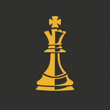

# ♟ Offline Chess — You vs AI

Bu loyiha **offline shaxmat o‘yini** bo‘lib, siz **sun’iy intellekt (AI)** bilan shaxmat o‘ynashingiz mumkin.  
Loyiha `HTML`, `CSS`, va `JavaScript` asosida qurilgan bo‘lib, `chess.js` kutubxonasidan foydalanadi.

---

## 🚀 Xususiyatlar
- ✅ **Responsive shaxmat taxtasi** (8x8, mobil qurilmalarda ham ishlaydi)  
- ✅ **Unicode shaxmat figuralari** (♔ ♕ ♖ ♗ ♘ ♙)  
- ✅ **AI (minimax + alpha-beta pruning)** — qiyinlik darajasi sozlanadi (1–4)  
- ✅ **“Undo” tugmasi** — oxirgi yurishni bekor qilish  
- ✅ **“Reset” tugmasi** — o‘yinni qaytadan boshlash  
- ✅ **“Export PGN”** — o‘yin tarixini `.pgn` faylga yuklab olish  
- ✅ **O‘yin holati va yurishlar konsoli** (Check, Checkmate, Draw va h.k.)  

---

## 📂 Foydalanish
1. Fayllarni yuklab oling:
   - `index.html` (asosiy fayl)
   - `chess.js` (chess.js kutubxonasi, [github](https://github.com/jhlywa/chess.js))
   - `favicon.jpg` (ixtiyoriy ikonka)

2. Brauzer orqali `index.html` ni oching.  
3. Tomon va AI darajasini tanlab, o‘yinni boshlang.  

---

## 🎮 Boshqaruv
- **Figurani yuritish**: katak ustiga bosib, so‘ngra manzilni tanlang.  
- **Undo**: Oxirgi yurishni bekor qiladi (ikkala tomonni ham).  
- **Reset**: O‘yinni yangidan boshlaydi.  
- **Export PGN**: PGN formatidagi yurishlar tarixini yuklab olish.  

---

## ⚙️ Texnologiyalar
- `HTML5`
- `CSS3`
- `JavaScript (ES6+)`
- `chess.js` kutubxonasi

---

## 📸 Ko‘rinishi

---

## 📝 Litsenziya
Ushbu loyiha **MIT License** asosida tarqatiladi.  
Batafsil ma’lumot uchun [`LICENSE`](LICENSE) faylini ko‘ring.
